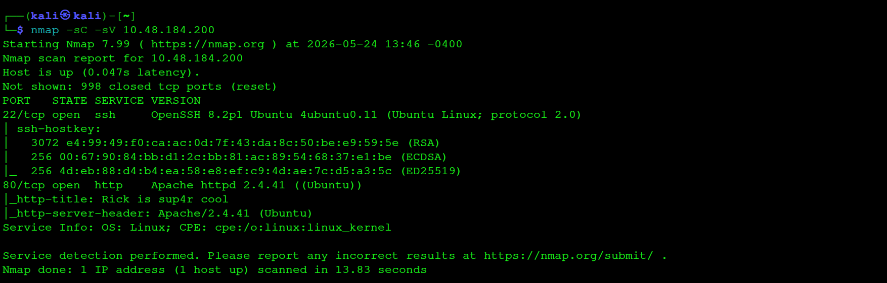

# Pickle-Rick-CTF--writeup
A beginner-friendly TryHackMe Pickle Rick CTF walkthrough demonstrating web enumeration, command injection, Linux navigation, and privilege escalation techniques.
This repository documents my walkthrough of the Pickle Rick CTF challenge from TryHackMe.
The objective of this room is to gain access to the target machine, identify vulnerabilities, and retrieve all three hidden ingredients.

 Objective
•	Gain initial access to the target machine 
•	Exploit misconfigurations and vulnerabilities 
•	Retrieve all 3 hidden ingredients (flags) 
•	Escalate privileges to root 

 Methodology Followed
The attack methodology followed a standard penetration testing approach:
1.	Reconnaissance 
2.	Enumeration 
3.	Exploitation 
4.	Privilege Escalation 
5.	Flag Retrieval 

 Phase 1: Reconnaissance
Nmap Scan
The first step was to perform network scanning using Nmap:
 

nmap -sC -sV <TARGET-IP>
Findings:
•	Port 22 → SSH (Open) 
•	Port 80 → HTTP Web Server (Open) 
Key Learning:
Nmap helped identify open ports and running services which are critical entry points for further enumeration.

 Phase 2: Web Enumeration
The web application was explored via browser on port 80.
 

Observations:
•	A Rick and Morty themed webpage was discovered 
•	No direct input fields initially visible 
Source Code Inspection:
Upon viewing page source, a username was discovered:
•	Username: R1ckRul3s 
Key Learning:
Sensitive information disclosure in HTML source code can aid attackers in gaining access.

 Phase 3: Directory Bruteforcing
To discover hidden directories, Gobuster was used:

 
gobuster dir -u http://<TARGET-IP> -w /usr/share/wordlists/dirb/common.txt
 

Discovered Paths:
•	/robots.txt 
•	/login.php 
•	/assets/ 

robots.txt Analysis
Visiting:
http://<TARGET-IP>/robots.txt
Revealed a hidden password:
•	Password: Wubbalubbadubdub 

 Phase 4: Authentication
Using the discovered credentials:
•	Username: R1ckRul3s 
•	Password: Wubbalubbadubdub 
Successfully logged into the application.

Phase 5: Command Injection
After login, a command execution panel was discovered.
 

Test:
whoami
Output:
www-data
This confirmed command injection vulnerability.

Exploitation:
Using basic Linux commands:
ls
cat Sup3rS3cretPickl3Ingred.txt
Result:
First ingredient retrieved successfully.

Phase 6: System Enumeration
Further exploration of the system:
pwd
ls -la
cd /home
ls
Discovered user directories and system files.

Phase 7: Privilege Escalation
Checked sudo permissions:
sudo -l
Result:
User had unrestricted sudo access.

Escalation:
sudo su
Now root access was obtained.

Phase 8: Final Flag Retrieval
cd /root
ls
cat 3rd.txt
Final ingredient successfully retrieved.

 Key Learnings
•	Network reconnaissance using Nmap 
•	Web application enumeration techniques 
•	Sensitive data exposure in robots.txt and source code 
•	Command injection exploitation 
•	Linux system navigation 
•	Privilege escalation via misconfigured sudo rights 

Tools Used
•	Nmap (Network scanning) 
•	Gobuster (Directory brute forcing) 
•	Linux CLI (System interaction) 
•	Browser DevTools (Source code analysis) 

 Conclusion
This challenge provided a practical introduction to real-world penetration testing concepts such as enumeration, exploitation, and privilege escalation. It strengthened my understanding of how misconfigurations in web applications can lead to full system compromise.
